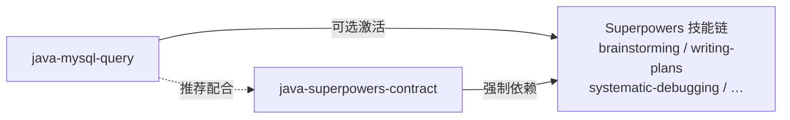

# java-developer-skill

Codex Java 工具技能包，包含数据库查询分析和研发管控契约两个技能。
安装后只需说话就能查询 MySQL 数据库、分析表结构、对比 Java 实体，并遵循标准化的研发管控流程。


<p align="center">
  
  
  
  
</p>
---

## 技能总览

| 技能 | 功能 | 一句话 |
|------|------|--------|
| `java-mysql-query` | MySQL 数据库查询与分析 | 说话查数据库，自动出深度分析报告 |
| `java-superpowers-contract` | Java 研发管控流程 | 需求分析→编码→审计，全流程标准化 |

---

## 依赖关系



---

## 前置条件

- **Codex 桌面版**（v1.0+）
- **Git**（用于克隆仓库）
- **Java 17+**（仅 `java-mysql-query` 需要）
- **MySQL 服务**（仅 `java-mysql-query` 需要，本地或远程均可）
- **MySQL JDBC 驱动**（`java-mysql-query` 首次运行时可自动安装）

---

## 安装流程

> **注意**：Codex 只在 `~/.codex/skills/` 的一级子文件夹下识别技能，不能嵌套在子目录中。

### 方式一：手动复制（推荐）

如果仓库已在 `C:\a\java-developer-skill`：

```cmd
xcopy /E /I /Y C:\a\java-developer-skill\skills\java-mysql-query %USERPROFILE%\.codex\skills\java-mysql-query
xcopy /E /I /Y C:\a\java-developer-skill\skills\java-superpowers-contract %USERPROFILE%\.codex\skills\java-superpowers-contract
```

### 方式二：从 GitHub 克隆后再复制

```cmd
git clone https://github.com/chichengyu/java-developer-skill.git %TEMP%\java-developer-skill
xcopy /E /I /Y %TEMP%\java-developer-skill\skills\java-mysql-query %USERPROFILE%\.codex\skills\java-mysql-query
xcopy /E /I /Y %TEMP%\java-developer-skill\skills\java-superpowers-contract %USERPROFILE%\.codex\skills\java-superpowers-contract
```

### 验证安装

重启 Codex 后，在聊天中输入以下任意提示，看技能是否响应：

- "帮我连接到本地 MySQL 数据库，查看所有表结构"
- "使用 Java 研发布控契约分析当前任务"

---
## 使用指南

### 1. java-mysql-query —— MySQL 数据库查询与分析

#### 首次连接（仅一次）

```bash
java -cp <skills目录>\java-mysql-query\scripts;<mysql-connector.jar> scripts.DatabaseQuery --db mydb --user root --password mypass --get-schema
```

连接成功后，凭证会**自动保存**到 `~/.java-mysql-query-config.json`，后续无需再输入账号密码。

#### 自动安装 JDBC 驱动

```bash
java -cp <skills目录>\java-mysql-query\scripts scripts.DatabaseQuery --install-driver
```

#### 可用命令

| 命令 | 说明 |
|------|------|
| `--get-schema` | 获取所有库表结构（引擎、列定义、主键、索引、注释） |
| `--analyze-all` | 全表统计分析（行数、大小、列数，按行数降序） |
| `--analyze-table <表名>` | 单表深度分析（逐列唯一值、NULL 率、极值、TOP 5 高频值） |
| `--get-relations` | 外键关系拓扑（含 Mermaid ERD 文本） |
| `--compare-entities --entity-path <路径>` | 对比 Java 实体类与数据库表结构差异 |
| `--pr-report [表名 ...]` | 生成 PR 报告（表结构摘要 + 实际行数） |
| `"SELECT ..."` | 执行自定义 SQL 查询 |
| `--save-config` | 手动保存连接配置 |
| `--clear-config` | 清除已保存的配置 |

#### 连接参数

| 参数 | 默认值 | 说明 |
|------|--------|------|
| `--host <host>` | `localhost` | 数据库主机地址 |
| `--port <port>` | `3306` | 数据库端口 |
| `--db <db>` | `DB_NAME` 环境变量或 `glo-trade-test_copy` | 数据库名称 |
| `--user <user>` | `root` | 数据库用户 |
| `--password <pwd>` | `DB_PASSWORD` 环境变量 | 数据库密码 |

#### 安全红线

- **严禁**执行 `DROP`、`DELETE`、`UPDATE`、`INSERT`、`ALTER`、`TRUNCATE` 等写操作
- 仅允许执行 `SELECT` 查询

---

### 2. java-superpowers-contract —— 研发布控契约

这是一个**流程契约型技能**，挂载后自动激活以下管控规则：

- **全中文交互**：所有分析、方案、说明强制使用中文
- **强制两阶段工作流**：
  - **阶段一**：只做影响分析，不写代码
  - **阶段二**：单步编码，展示后等待确认再落盘
- **最小改动原则**：保护既有业务逻辑，严禁大面积重构
- **Git 环境硬隔离**：仅限当前分支，禁止污染其他分支
- **全时执行审计**：每次回复末尾附【执行审计】模块
- **方法级锚定**：所有提及的文件、类、方法必须标注 `[已有]` / `[新增]`

**激活方式**：加载技能后，发起任何 Java 开发相关的需求即可自动触发。

---

## 技能卸载

```bash
# 删除技能目录
rm -rf ~\.codex\skills\java-mysql-query
rm -rf ~\.codex\skills\java-superpowers-contract
```

删除后重启 Codex 即可。

---

## 目录结构

```
C:\a\java-developer-skill\
├── README.md
└── skills\
    ├── java-mysql-query\            # MySQL 数据库查询与分析技能
    │   ├── SKILL.md                 # 技能描述与使用说明
    │   ├── agents\openai.yaml       # Codex Agent 接口定义
    │   ├── scripts\                 # Java 工具脚本
    │   │   ├── DatabaseQuery.java   # 源码
    │   │   ├── DatabaseQuery.class  # 编译主类
    │   │   ├── DatabaseQuery$EntityInfo.class
    │   │   └── DatabaseQuery$FieldInfo.class
    │   └── references\              # 引用文件（预留）
    └── java-superpowers-contract\   # 研发布控契约技能
        ├── SKILL.md                 # 完整契约规则
        ├── agents\openai.yaml       # Codex Agent 接口定义
        ├── scripts\                 # 脚本目录（预留）
        └── references\              # 引用文件（预留）
```

---

## 常见问题

**Q: java-mysql-query 提示找不到 JDBC 驱动？**  
A: 运行 `--install-driver` 命令自动下载安装，或手动下载 `mysql-connector-j-8.3.0.jar` 放到 `scripts/` 目录。

**Q: 每次都要输入密码很麻烦？**  
A: 首次连接使用 `--password` 参数后，凭证会自动保存到配置文件，后续免输。

**Q: 两个技能必须一起安装吗？**  
A: 不必。可以只安装其中一个，各自独立使用，互不依赖。

