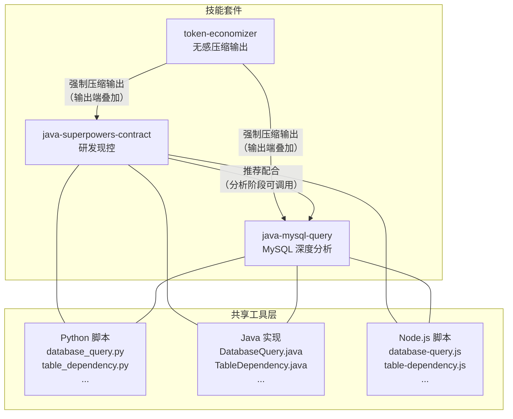
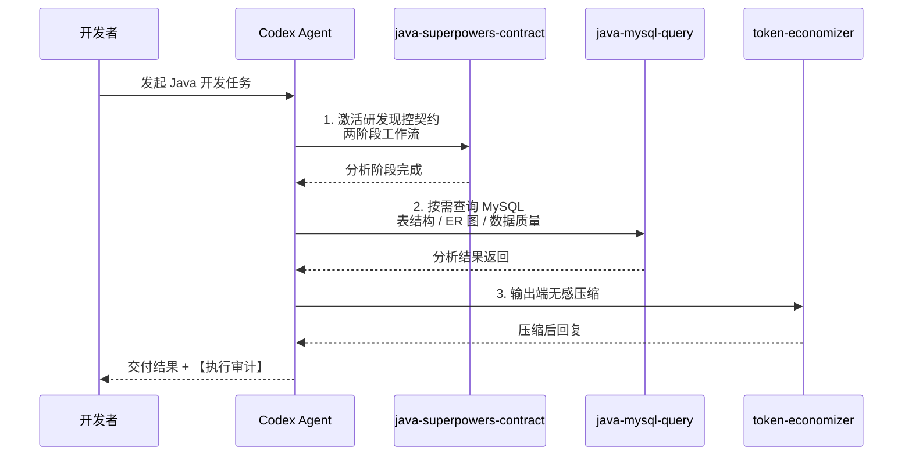

# java-developer-skill — Java 开发者 Codex 技能套件

<p align="center">
  
  
  
  
  
</p>

## 项目简介

**java-developer-skill** 是一套专为 Java 开发者打造的 Codex 技能集合，旨在提升 Codex 在 Java 项目中的数据库分析、研发现控和输出压缩能力。本套件包含三个可独立安装的技能：

| 技能 | 角色 | 关键能力 |
|------|------|----------|
| **java-mysql-query** | MySQL 深度分析师 | 自然语言查表结构、ER 图、数据质量、SQL 优化 |
| **java-superpowers-contract** | 研发现控官 | Git worktree 隔离、四层分析契约、强制审计 |
| **token-economizer** | 输出压缩师 | 无感压缩 Codex 输出，降低 Token 消耗 |

三者既可独立使用，也可串联组成完整的 Java 研发辅助链路。

---

## 目录结构

```
java-developer-skill/
+-- README.md                          # 项目说明（本文档）
+-- LICENSE                            # MIT 许可协议
+-- .gitattributes                     # Git 属性配置
+-- .gitignore                         # Git 忽略规则
|
+-- skills/
|   +-- java-mysql-query/              # MySQL 深度查询与分析
|   |   +-- SKILL.md                   #   技能说明书
|   |   +-- agents/
|   |   |   +-- openai.yaml            #   Agent 配置
|   |   +-- references/
|   |   |   +-- .gitkeep
|   |   +-- scripts/                   #   三语言工具脚本
|   |       +-- database_query.py      +   database-query.js      +   DatabaseQuery.java
|   |       +-- table_dependency.py    +   table-dependency.js    +   TableDependency.java
|   |       +-- erd_viewer.py          +   erd-viewer.js          +   ErdViewer.java
|   |       +-- sql_explain_analyzer.py+   sql-explain-analyzer.js+   SqlExplainAnalyzer.java
|   |       +-- audit_report_generator.py  +   ...  .java/.js
|   |       +-- csv_exporter.py        +   csv-exporter.js        +   CsvExporter.java
|   |       +-- cicd_helper.py         +   cicd-helper.js         +   CicdHelper.java
|   |       +-- req_analyzer.py        +   req-analyzer.js        +   ReqAnalyzer.java
|   |       +-- skill_bridge.py        +   skill-bridge.js        +   SkillBridge.java
|   |
|   +-- java-superpowers-contract/     # Java 研发现控契约
|   |   +-- SKILL.md                   #   技能说明书
|   |   +-- agents/
|   |   |   +-- openai.yaml            #   Agent 配置
|   |   +-- references/
|   |   |   +-- .gitkeep
|   |   +-- scripts/                   #   三语言工具脚本
|   |       +-- (同 java-mysql-query/scripts/ 的 9 组三语言脚本)
|   |
|   +-- token-economizer/              # Token 输出压缩器
|       +-- SKILL.md                   #   技能说明书
|       +-- agents/
|       |   +-- openai.yaml            #   Agent 配置
|       +-- references/
|           +-- compression-patterns.md # 压缩模式参考
```

---

## 安装

**方式一：复制粘贴命令**

```cmd
:: 将 <REPO_DIR> 替换为你本地仓库的实际路径
xcopy /E /I /Y <REPO_DIR>\skills\java-mysql-query %USERPROFILE%\.codex\skills\java-mysql-query
xcopy /E /I /Y <REPO_DIR>\skills\java-superpowers-contract %USERPROFILE%\.codex\skills\java-superpowers-contract
xcopy /E /I /Y <REPO_DIR>\skills\token-economizer %USERPROFILE%\.codex\skills\token-economizer
```

安装 Python 依赖：`pip install pymysql`

重启 Codex，输入 `"帮我连接到本地 MySQL"` 验证。

**方式二：对话安装（复制给 Codex）**

```
帮我从仓库 [chichengyu/java-developer-skill](https://github.com/chichengyu/java-developer-skill) 安装 java-mysql-query、java-superpowers-contract 和 token-economizer 技能到 ~/.codex/skills/ 目录下
```

---

## 依赖关系



### 技能链调用流程



---

## 技能功能

### java-mysql-query — MySQL 深度查询与分析

**核心能力：** 通过自然语言完成 MySQL 数据库的全链路分析。

功能清单：

| 功能 | 说明 | 一句话描述 |
|------|------|-----------|
| 表结构分析 | 自动输出 schema、字段类型、索引、约束 | 说话查数据库，自动输出完整表结构 |
| 表依赖关系图 | 基于外键构建表依赖拓扑（Mermaid 图表） | 说话查数据库，自动输出表依赖图 |
| ER 图 | 实体关系可视化 | 说话查数据库，自动输出 ERD |
| 数据质量评估 | 三指标：NULL 率、空串率、哨兵值率 | 说话查数据库，自动输出深度分析报告 |
| SQL EXPLAIN 分析 | 执行计划解读与优化建议 | 说话查数据库，自动输出 SQL 优化建议 |
| CSV 导出 | 查询结果导出为 CSV 文件 | 说话查数据库，自动导出为 CSV |
| Java 实体对比 | 对比数据库表与现有 Java 实体类的字段一致性 | 说话查数据库，自动输出实体对比 |
| 需求分析 | 结合业务需求给出数据模型建议 | 说话查数据库，自动输出分析报告 |

**入口：** `scripts/database_query.py`（三语言实现：Python / Node.js / Java）

---

### java-superpowers-contract — Java 研发现控契约

**核心能力：** 为 Java 项目提供全流程研发现控，强制最小改动、物理隔离与审计跟踪。

> **安装后自动强制无感使用：** 本技能采用零门槛全时激活机制。用户发起任何 Java 开发需求对话时，Codex 在底层自动唤醒 Superpowers 全技能链进行完整分析与规划，无需用户主动提及关键词或手动激活。安装即生效，全程无感。

功能清单：

| 功能 | 说明 |
|------|------|
| Git worktree 物理隔离 | 每次操作在独立 worktree 中完成，主仓库不变 |
| 两阶段工作流 | 分析 → 编码，分析阶段不生成代码 |
| 四层分析协议 | Controller / Service / Repository / Event 逐层审查 |
| 方法级锚定 | [已有] / [新增] 标记，明确代码变更范围 |
| DDL 强制 rollback | 数据库结构变更自动生成回滚脚本 |
| 安全审查 | SQL 注入检测、密钥硬编码检查、API 兼容性检查 |
| 执行审计 | 每次回复附带【执行审计】报告 |


---

### token-economizer v3 — 输出压缩器

**核心能力：** 无感压缩 Codex 输出，降低 Token 消耗，提升回复效率。

9 层 18 条铁律：

| 层面 | 规则 |
|------|------|
| 零废话 | 移除冗余描述、客套话、重复内容 |
| 预算裁剪 | 单文件 0 行注释、教学场景 <= 10 行 |
| 超限熔断 | 超出预算标记 `[裁:X行]` 并截断 |
| Java 特化 | 注解直引、签名压缩、异常缩写 |
| 质量门禁 | 自检清单保障压缩不影响语义完整性 |

**依赖：** 零外部依赖，纯指令契约，在输出端对前两者叠加压缩。

---

三者可独立安装。`java-mysql-query` 和 `java-superpowers-contract` 共享 9 套三语言工具，`token-economizer` 为纯指令契约零依赖，在输出端对前两者叠加压缩。

完整命令参考：[java-mysql-query](skills/java-mysql-query/SKILL.md) / [java-superpowers-contract](skills/java-superpowers-contract/SKILL.md) / [token-economizer](skills/token-economizer/SKILL.md)


