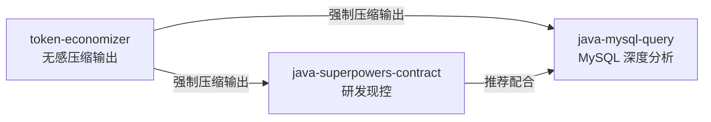

# java-developer-skill

<p align="center">
  
  
  
  
  
</p>

## 安装

**方式一：复制粘贴命令**

```cmd
:: 将 <REPO_DIR> 替换为你本地仓库的实际路径
xcopy /E /I /Y <REPO_DIR>\skills\java-mysql-query %USERPROFILE%\.codex\skills\java-mysql-query
xcopy /E /I /Y <REPO_DIR>\skills\java-superpowers-contract %USERPROFILE%\.codex\skills\java-superpowers-contract
xcopy /E /I /Y <REPO_DIR>\skills\token-economizer %USERPROFILE%\.codex\skills\token-economizer
```

安装 Python 依赖：`pip install pymysql`

重启 Codex，输入 `"帮我连接到本地 MySQL"` 验证。

**方式二：对话安装（复制给 Codex）**

```
帮我安装 java-mysql-query、java-superpowers-contract 和 token-economizer 技能到 ~/.codex/skills/ 目录下
```

---

## 依赖关系



## 技能功能

**java-mysql-query** — 自然语言查 MySQL。自动输出 schema、表依赖图、ERD、数据质量三指标（NULL率/空串率/哨兵值率）。支持 EXPLAIN 分析、CSV 导出、Java 实体对比。入口 `database_query.py`，三语言（Python/Node.js/Java）。

**java-superpowers-contract** — Java 全流程研发现控契约。强制最小改动、Git worktree 物理隔离、四层分析协议（Controller/Service/Repository/Event）、方法级锚定 `[已有]/[新增]`、DDL 强制 rollback、安全审查（SQL注入/密钥硬编码/API兼容性）。每次回复附带【执行审计】。

**token-economizer v3** — 无感压缩 Codex 输出。9 层 18 条铁律：零废话、预算裁剪（单文件 0 行/教学 10 行）、超限熔断 `[裁:X行]`、Java 特化压缩（注解直引/签名压缩/异常缩写）、质量门禁自检。[详情](skills/token-economizer/SKILL.md)

三者可独立安装。`java-mysql-query` 和 `java-superpowers-contract` 共享 9 套三语言工具，`token-economizer` 为纯指令契约零依赖，在输出端对前两者叠加压缩。

完整命令参考：[java-mysql-query](skills/java-mysql-query/SKILL.md) / [java-superpowers-contract](skills/java-superpowers-contract/SKILL.md) / [token-economizer](skills/token-economizer/SKILL.md)
