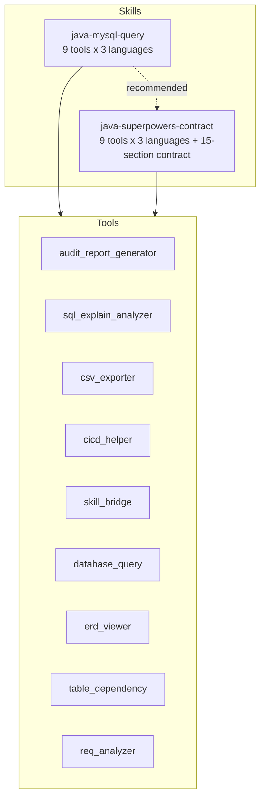

# java-developer-skill

Codex Java 工具技能包 — 涵盖 **MySQL 数据库深度分析** 和 **Java 研发现控契约** 两大技能。
所有工具支持 **Python / Node.js / Java** 三种语言，配置优先级 **Python > Node.js > Java**。

<p align="center">
  
  
  
  
  
  
</p>

---

## 技能总览

| 技能 | 功能 | 一句话 |
|------|------|--------|
| `java-mysql-query` | MySQL 数据库深度分析与可视化 | 说话查数据库，自动输出表依赖图/ERD/深度分析报告 |
| `java-superpowers-contract` | Java 全流程研发现控契约 | 需求分析→编码→审计与回滚，全流程标准化管控 |

**两个技能既可独立安装，也可配合使用**。每个技能附带 9 个配套工具，每种工具均提供 Python / Node.js / Java 三种语言版本。

### 配置优先级 vs 技术依赖

| | 配置优先级（用户首选） | 技术依赖链 |
|--|----------------------|-----------|
| **Python** | 🥇 首选 | `database_query.py` → `pymysql` → **MySQL（零Java依赖）** |
| **Node.js** | 🥈 次选 | `database-query.js` → `mysql2` → **MySQL（零Java依赖）** |
| **Java** | 🥉 备选 | `DatabaseQuery.java` → JDBC → MySQL（需编译） |

> ✅ **架构升级 v2**：Python 和 Node.js 已改用原生数据库驱动直连 MySQL，不再依赖 Java subprocess。`pip install pymysql` 或 `npm install mysql2` 后即可使用，无需安装 JDK、无需配置 classpath、无需编译 `.class` 文件。
> Java 版本 `DatabaseQuery.java` 作为备选引擎保留，仅当需要使用 Java 专属功能（如 `--compare-entities` Java 实体对比）时编译加载。

---

## 依赖关系



---

## 前置条件

| 组件 | 版本要求 | 用途 | 必需性 |
|------|---------|------|--------|
| Python | 3.8+ | **首选运行时**，`pymysql` 直连 MySQL | **推荐（零Java依赖）** |
| Node.js | 18+ | 次选运行时，`mysql2` 直连 MySQL | 可选 |
| Java (JDK) | 17+ | 仅 Java 版 `DatabaseQuery.java` 需要编译 | 可选（备选引擎） |
| MySQL 服务 | 5.7+ | 数据库 | 必需（本地或远程） |
| Codex 桌面版 | v1.0+ | 技能加载 | 必需 |

---

## 安装流程

> Codex 只在 `~/.codex/skills/` 的一级子文件夹下识别技能，不能嵌套在子目录中。

```cmd
xcopy /E /I /Y C:\a\java-developer-skill\skills\java-mysql-query %USERPROFILE%\.codex\skills\java-mysql-query
xcopy /E /I /Y C:\a\java-developer-skill\skills\java-superpowers-contract %USERPROFILE%\.codex\skills\java-superpowers-contract
```

### 日常使用：纯 Python 启动（零 Java 依赖）

```bash
# 1. 安装依赖（仅首次）
pip install pymysql

# 2. 直接使用，无需安装 Java、无需编译
python database_query.py --db mydb --analyze-table user
python erd_viewer.py --db mydb --output erd.html
python table_dependency.py --db mydb --output deps.html

# 3. Node.js 方式（二选一）
npm install mysql2
node database-query.js --db mydb --get-schema
```

### 仅 Java 引擎需要编译

如果选择 Java 版本，需额外准备 JDK 17+ 和 MySQL JDBC 驱动：

```cmd
javac -encoding utf8 DatabaseQuery.java
java -cp .;mysql-connector-j-8.3.0.jar scripts.DatabaseQuery --db mydb --get-schema
```

### 验证安装

重启 Codex，输入以下任意提示测试是否响应：
- "帮我连接到本地 MySQL，查看所有表结构"
- "分析 user 表的数据质量"
- "使用契约分析新增用户接口的需求影响"

---

## 1. java-mysql-query —— MySQL 数据库深度分析

### 核心工具

> 💡 **日常操作全部通过 Python 包装器**：`python database_query.py --db mydb --analyze-table user`
> 原始 Java 命令 `java -cp ... scripts.DatabaseQuery ...` 仅在一键安装、首次场景使用。

| 命令 | 说明 | 增强内容 |
|------|------|---------|
| `--get-schema` | 获取所有库表结构（引擎/列/主键/索引/注释） | — |
| `--analyze-all` | 全表统计分析（行数/大小/列数） | — |
| `--analyze-table <表>` | **单表深度分析** | **数据质量三指标：NULL率/空字符串率/哨兵值率 + qualityScore** |
| `--analyze-deep <表>` | **深度分析（新增）** | **标准差/直方图/索引分析/分布桶/空值统计** |
| `--table-deps` | **表依赖关系分析（新增）** | **拓扑层级 + 环形依赖检测 + 影响链 + Mermaid DAG 图** |
| `--get-relations` | 外键关系拓扑 + Mermaid ERD | — |
| `--explain <SQL>` | **查询计划分析（新增）** | **EXPLAIN FORMAT=JSON 输出** |
| `--export-csv <SQL>` | **CSV导出（新增）** | **标准CSV格式，含表头/引号转义** |
| `--compare-entities` | Java实体 vs 数据库表对比 | — |
| `--pr-report [表...]` | PR报告生成 | — |
| `--save-config` | 保存连接配置 | **密码加密存储（新增）** |
| `--clear-config` | 清除配置 | — |

### 连接参数

| 参数 | 默认值 | 说明 |
|------|--------|------|
| `--host <host>` | `localhost` | 数据库主机地址 |
| `--port <port>` | `3306` | 数据库端口 |
| `--db <db>` | `DB_NAME` 环境变量 | 数据库名称 |
| `--user <user>` | `root` | 数据库用户 |
| `--password <pwd>` | `DB_PASSWORD` 环境变量 | 数据库密码 |
| `--ssl <mode>` | `false` | SSL 模式：`false` / `true` / `verify-ca` |

### 密码安全

密码支持 3 种传递方式（优先级从高到低）：
1. **环境变量法（推荐）**：`$env:DB_PASSWORD = "your_password"; java ...`
2. **配置文件法**：首次 `--password` 连接后自动加密保存到 `~/.java-mysql-query-config.json`
3. **CLI 参数法**：`java ... --password "your_password"`（PowerShell 中密码含 `$` 需用单引号）

### 数据质量三指标分析（--analyze-table）

每个字段输出 **NULL率 / 空字符串率 / 哨兵值率** 三个质量指标 + **综合质量评分**：
- **NULL率**: >80%=冗余字段, 20~80%=需补充默认值, <5%且NOT NULL=正常
- **空字符串率**: >30%=字段设计问题, NULL与空字符串混用=业务逻辑歧义
- **哨兵值率**: >10%=业务层使用哨兵值(`0`/`-1`/`1900-01-01`/`1970-01-01`/`9999-12-31`)替代NULL

---

## 2. java-superpowers-contract —— Java 研发现控契约

**9 个章节的精简管控契约**（优化前 404 行 → 76 行），加载后自动激活以下规则：

| 章节 | 内容 |
|------|------|
| 一 | 100% 纯中文交互 |
| 二 | Superpowers 全自动拆解机制 |
| 三 | 最小改动原则（Least Intrusion）|
| 四 | Git 分支隔离 + Worktree 物理硬隔离 + 稀疏检出 |
| 五 | 智能 SQL 交付 + 密码引号包裹 + 数据质量三指标 + 配置管理 |
| 六 | 两阶段工作流（分析→编码）|
| 七 | 方法级锚定（[已有]/[新增] 标注）|
| 八 | Java 四层分析协议（Controller/Service/Repository/Event）|
| 九 | 审计报告生成器（Python/Node.js/Java 三引擎）|
| 十 | 数据库变更回滚红线（DDL 必带 rollback）|
| 十一 | 代码审查与安全检查清单 |
| 十二 | 秘密管理体系（环境隔离 / Git 防泄露 / 密钥轮换）|
| 十三 | API 兼容性红线（禁止破坏性变更 / 版本化策略）|
| 十四 | 工具链集成总览（9 工具 × 3 语言）|
| 十五 | 需求深度分析框架（ReqAnalyzer + 四层穿透分析）|

### 审计报告自动生成

```bash
# Python（首选）
python scripts/audit_report_generator.py --sample --format html --output audit.html

# Node.js（次选）
node scripts/audit-report-generator.js --sample --format markdown --output audit.md

# Java（备选）
java -cp . scripts.AuditReportGenerator --sample --format json
```

---

## 3. 配套工具一览

### 所有工具三语言覆盖

| # | 工具 | Python | Node.js | Java | 功能 |
|---|------|--------|---------|------|------|
| 1 | **审计报告生成器** | `audit_report_generator.py` | `audit-report-generator.js` | `AuditReportGenerator.java` | 生成 JSON/Markdown/HTML 审计报告 |
| 2 | **查询计划分析器** | `sql_explain_analyzer.py` | `sql-explain-analyzer.js` | `SqlExplainAnalyzer.java` | EXPLAIN 查询计划 + 性能瓶颈识别 |
| 3 | **CSV 导出器** | `csv_exporter.py` | `csv-exporter.js` | `CsvExporter.java` | SQL 结果 → CSV 文件 |
| 4 | **CI/CD 集成助手** | `cicd_helper.py` | `cicd-helper.js` | `CicdHelper.java` | Git 提交校验 / pre-commit 钩子 |
| 5 | **Skill 桥接器** | `skill_bridge.py` | `skill-bridge.js` | `SkillBridge.java` | DatabaseQuery → 审计报告自动转换 |
| 6 | **DatabaseQuery 包装** | `database_query.py` | `database-query.js` | `DatabaseQuery.java` | 命令行的 Python/Node 原生包装 |
| 7 | **ERD 关系图查看器** | `erd_viewer.py` | `erd-viewer.js` | `ErdViewer.java` | FK 关系 → Mermaid 可视 HTML |
| 8 | **表依赖关系分析器** | `table_dependency.py` | `table-dependency.js` | `TableDependency.java` | 拓扑层级 + 环形依赖 + 影响链图 |
| 9 | **需求深度分析器** | `req_analyzer.py` | `req-analyzer.js` | `ReqAnalyzer.java` | 需求 → 四层影响分析报告 |

### 端到端自动化流程

```bash
# 1. 连接数据库，查看所有表结构
python database_query.py --db mydb --get-schema

# 2. 深度分析数据质量
python database_query.py --db mydb --analyze-deep user

# 3. 查看表依赖关系
python table_dependency.py --db mydb --output deps.html

# 4. 查看外键关系 ERD
python erd_viewer.py --db mydb --output erd.html

# 5. 分析慢查询
python sql_explain_analyzer.py --db mydb "SELECT * FROM user WHERE email = 'test@test.com'"

# 6. 导出数据
python csv_exporter.py --db mydb "SELECT id, name FROM user" --output users.csv

# 7. 生成审计报告
python skill_bridge.py --db mydb --tables user order --output quality_report
python audit_report_generator.py --sample --format html --output audit_report.html

# 8. 深度分析需求影响
python req_analyzer.py "新增用户年龄字段，支持按年龄分组统计" --format html --output analysis.html

# 9. CI/CD 集成
python cicd_helper.py --check-commit-msg "feat(user): 新增年龄字段"
python cicd_helper.py --pre-commit-install
```

---

## 安全红线

- **严禁**执行 `DROP` / `DELETE` / `UPDATE` / `INSERT` / `ALTER` / `TRUNCATE` 写操作（仅 `SELECT`）
- 密码传递优先级：**环境变量 > 加密配置文件 > CLI 参数**
- 每张 DDL 变更必须附带 `-- rollback` 逆操作
- 禁止将生产环境密码写入 `.yml` 配置文件或提交到 Git

---

## 目录结构

```
C:\a\java-developer-skill\
├── README.md
└── skills\
    ├── java-mysql-query\                 # MySQL 数据库深度分析技能
    │   ├── SKILL.md                      # 技能描述与命令参考
    │   ├── agents\openai.yaml            # Codex Agent 接口定义
    │   ├── scripts\                      # 27 个文件（9 工具 × 3 语言）
    │   │   ├── DatabaseQuery.java        # 核心 Java 工具（1123 行，58KB）
    │   │   ├── audit_report_generator.py # Python 版配套工具
    │   │   ├── audit-report-generator.js # Node.js 版
    │   │   ├── AuditReportGenerator.java # Java 版
    │   │   ├── sql_explain_analyzer.py   # ... 共 9 组 × 3 语言
    │   │   ├── ...
    │   └── references\
    └── java-superpowers-contract\        # Java 研发现控契约
        ├── SKILL.md                      # 15 节完整契约（30KB）
        ├── agents\openai.yaml
        ├── scripts\                      # 27 个文件（9 工具 × 3 语言）
        │   ├── audit_report_generator.py
        │   ├── ...
        └── references\
```

---

## 常见问题

**Q: Python 需要安装什么依赖？**  
A: 只需 `pip install pymysql`。无需安装 JDK、无需下载 JDBC 驱动、无需编译 `.class` 文件。

**Q: Node.js 需要安装什么依赖？**  
A: 只需 `npm install mysql2`。用法同 Python 版。

**Q: Java 还需要吗？**  
A: Java 作为备选引擎保留。仅当需要使用 `--compare-entities`（Java 实体对比）、或需嵌入现有 Java 生产环境时，才需要编译 DatabaseQuery.java。

**Q: 每次都要输入密码？**  
A: 首次使用 `--password` 后，密码自动加密保存到 `~/.java-mysql-query-config.json`，后续免输。

**Q: 两个技能必须一起安装吗？**  
A: 不必。可单独安装任一技能，配套工具各自独立完整。

**Q: 三个语言版本怎么选？**  
A: 优先 Python（最快启动、pymysql 直连、最广泛支持），Node.js 适合 Web 前端集成，Java 适合生产环境嵌入。
