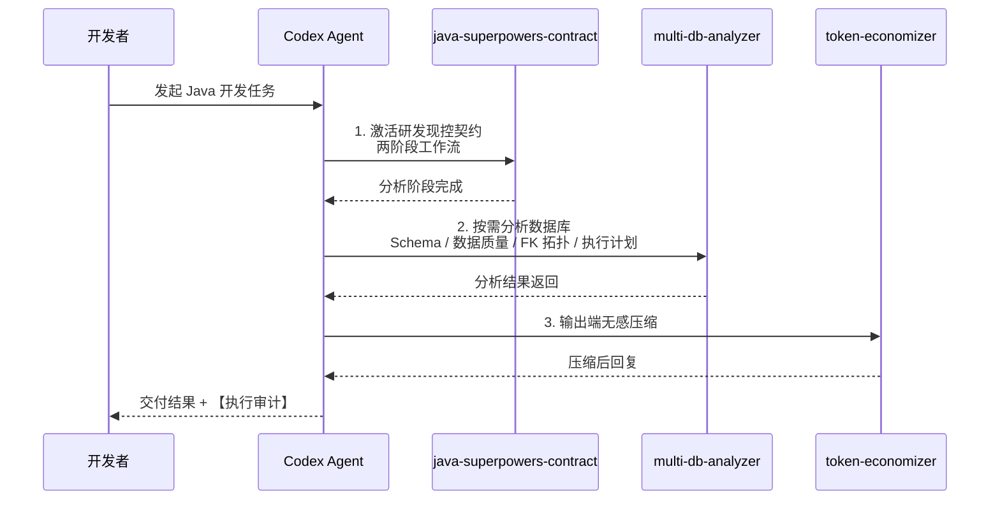
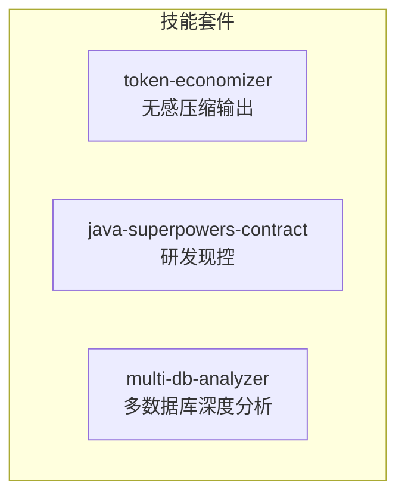

# java-developer-skill — Java 开发者 Codex 技能套件

<p align="center">
  
  
  
  
  
</p>

## 项目简介

**java-developer-skill** 是一套专为 Java 开发者打造的 Codex 技能集合，旨在提升 Codex 在 Java 项目中的数据库分析、研发现控和输出压缩能力。本套件包含三个可独立安装的技能：

| 技能 | 角色 | 关键能力 |
|------|------|----------|
| **multi-db-analyzer** | 多数据库深度分析师 | 15+ 数据库引擎统一分析：Schema、数据质量、FK拓扑、执行计划 |
| **java-superpowers-contract** | 研发现控官 | Git worktree 隔离、四层分析契约、强制审计 |
| **token-economizer** | 输出压缩师 | 无感压缩 Codex 输出，降低 Token 消耗 |

三者既可独立使用，也可串联组成完整的 Java 研发辅助链路。

---

## 目录结构

```
java-developer-skill/
+-- README.md
+-- LICENSE
+-- .gitattributes
+-- .gitignore
+-- skills/
|   +-- multi-db-analyzer/              # 多数据库深度查询与分析
|   +-- java-superpowers-contract/     # Java 研发现控契约
|   +-- token-economizer/              # Token 输出压缩器
```

---

## 安装

**方式一：复制粘贴命令**

```cmd
:: 将 <REPO_DIR> 替换为你本地仓库的实际路径
xcopy /E /I /Y <REPO_DIR>\skills\multi-db-analyzer %USERPROFILE%\.codex\skills\multi-db-analyzer
xcopy /E /I /Y <REPO_DIR>\skills\java-superpowers-contract %USERPROFILE%\.codex\skills\java-superpowers-contract
xcopy /E /I /Y <REPO_DIR>\skills\token-economizer %USERPROFILE%\.codex\skills\token-economizer
```

安装 Python 依赖（按需选装）：
```cmd
pip install pymysql           # MySQL / MariaDB / TiDB
pip install psycopg2-binary   # PostgreSQL
pip install pymssql           # SQL Server
pip install oracledb          # Oracle
pip install redis             # Redis
pip install elasticsearch     # Elasticsearch
pip install pymongo           # MongoDB
pip install influxdb-client   # InfluxDB
pip install qdrant-client     # Qdrant
# SQLite 为内置驱动，无需安装
```

重启 Codex，输入 `"帮我分析数据库"` 验证。

**方式二：对话安装（复制给 Codex）**

```
帮我从仓库 [chichengyu/java-developer-skill](https://github.com/chichengyu/java-developer-skill) 安装 multi-db-analyzer、java-superpowers-contract 和 token-economizer 技能到 ~/.codex/skills/ 目录下
```

---

## 依赖关系


### 技能链调用流程



---

## 技能功能

### multi-db-analyzer — 多数据库深度查询与分析

**核心能力：** 纯 Python 多数据库统一分析工具，支持 15+ 数据库引擎，零 Java 依赖。

**支持的数据库：**

| 类型 | 数据库 |
|------|--------|
| SQL | MySQL / MariaDB / PostgreSQL / SQLite / SQL Server / Oracle / TiDB |
| NoSQL | Redis / Elasticsearch / MongoDB |
| 时序 | InfluxDB / TDengine |
| 向量 | Qdrant / Milvus / DolphinDB |

功能清单：

| 功能 | 说明 | 适用范围 |
|------|------|----------|
| Schema 扫描 | 列出所有表/索引/集合及元数据 | 所有引擎 |
| 数据质量分析 | NULL 率、空串率、哨兵值率三指标 | SQL 引擎 |
| FK 拓扑 | 基于外键构建表依赖关系图 | SQL + MongoDB |
| 表依赖图 | 表间依赖拓扑可视化 | SQL 引擎 |
| 执行计划分析 | EXPLAIN 解读与优化建议 | SQL 引擎 |
| CSV 导出 | 查询结果导出为 CSV | SQL 引擎 |
| PR 报告 | 带快照的变更报告 | SQL 引擎 |
| Java 实体对比 | 对比数据库表与 Java 实体类的字段一致性 | SQL 引擎 |
| 凭据管理 | 首次连接后自动保存到 ~/.multi-db-analyzer-config.json | 所有引擎 |
| 原生查询 | 直接执行原生 SQL / 命令 | 所有引擎 |

**入口：** `scripts/database_query.py`（纯 Python 实现，统一 CLI 接口）

完整命令参考：[multi-db-analyzer](https://github.com/chichengyu/java-developer-skill/blob/main/skills/multi-db-analyzer/SKILL.md)

---

### java-superpowers-contract — Java 研发现控契约

**核心能力：** 为 Java 项目提供全流程研发现控，强制最小改动、物理隔离与审计跟踪。

> **安装后自动强制无感使用：** 本技能采用零门槛全时激活机制。用户发起任何 Java 开发需求对话时，Codex 在底层自动唤醒 Superpowers 全技能链进行完整分析与规划，无需用户主动提及关键词或手动激活。安装即生效，全程无感。

功能清单：

| 功能 | 说明 |
|------|------|
| Git worktree 物理隔离 | 每次操作在独立 worktree 中完成，主仓库不变 |
| 两阶段工作流 | 分析 → 编码，分析阶段不生成代码 |
| 四层分析协议 | Controller / Service / Repository / Event 逐层审查 |
| 方法级锚定 | [已有] / [新增] 标记，明确代码变更范围 |
| DDL 强制 rollback | 数据库结构变更自动生成回滚脚本 |
| 安全审查 | SQL 注入检测、密钥硬编码检查、API 兼容性检查 |
| 执行审计 | 每次回复附带【执行审计】报告 |

完整命令参考：[java-superpowers-contract](https://github.com/chichengyu/java-developer-skill/blob/main/skills/java-superpowers-contract/SKILL.md)


---

### token-economizer v3 — 输出压缩器

**核心能力：** 无感压缩 Codex 输出，降低 Token 消耗，提升回复效率。

> **安装后自动强制无感使用：** 本技能采用强制自动激活机制。所有对话、所有会话状态下自动底层加载运行，无需任何关键词，用户全程无感知。本技能在所有其它技能的输出层之上叠加生效，具有最高优先级，跨会话持久，每次启动自动加载。

9 层 18 条铁律：

| 层面 | 规则 |
|------|------|
| 零废话 | 移除冗余描述、客套话、重复内容 |
| 预算裁剪 | 单文件 0 行注释、教学场景 <= 10 行 |
| 超限熔断 | 超出预算标记 `[裁:X行]` 并截断 |
| Java 特化 | 注解直引、签名压缩、异常缩写 |
| 质量门禁 | 自检清单保障压缩不影响语义完整性 |

**依赖：** 零外部依赖，纯指令契约，在输出端对前两者叠加压缩。

完整命令参考：[token-economizer](https://github.com/chichengyu/java-developer-skill/blob/main/skills/token-economizer/SKILL.md)

---




三者可独立安装。`multi-db-analyzer` 为纯 Python 实现，`java-superpowers-contract` 附带三语言工具链，`token-economizer` 为纯指令契约零依赖，在输出端对前两者叠加压缩。


