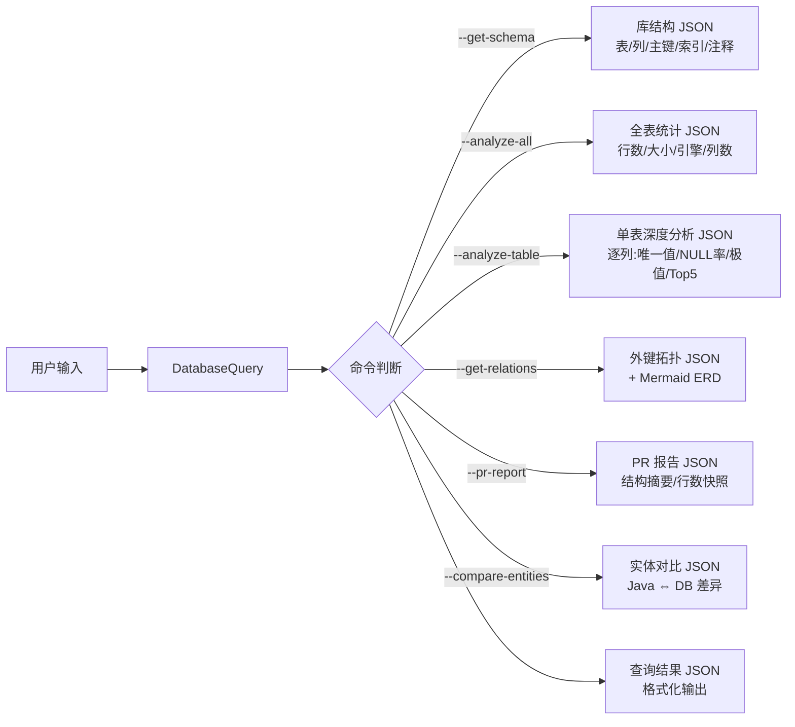

## 运行前置条件
1. 确保本地 MySQL 服务已启动。
2. MySQL JDBC 驱动 JAR 必须位于 classpath 中。如果缺失工具会自动检测并提示安装方式。
3. 数据库凭据**只需首次输入一次**，之后自动保存无需重复输入（兼容语音场景）。
4. 同时也支持 CLI 参数和环境变量 `DB_PASSWORD`、`DB_NAME` 作为备选。
5. **编译注意**：本文件使用 UTF-8 编码，重新编译时请加 `-encoding utf8` 参数。

## 凭证持久化（一次输入，永久使用）
该工具会自动将数据库连接信息保存到 `~/.java-mysql-query-config.json`，**后续全部免输**。

### 使用流程
**第一步（仅一次）**：完整传入连接参数执行任意命令
```
java -cp <skill目录>;<mysql-connector.jar> scripts.DatabaseQuery --db mydb --user root --password mypass --get-schema
```
连接成功后，凭证**自动保存**到配置文件。

**第二步及以后**：后续只说话即可，无需再输任何账号密码
```
java -cp ... scripts.DatabaseQuery --analyze-all
java -cp ... scripts.DatabaseQuery --analyze-table user
java -cp ... scripts.DatabaseQuery --get-relations
```

### 显式管理
| 命令 | 作用 |
|------|------|
| `--save-config` | 手动保存当前连接参数到配置文件 |
| `--clear-config` | 清除已保存的配置文件 |

## 首次安装
如果运行 `DatabaseQuery` 时提示 "MySQL JDBC 驱动未找到"，请执行：

```
java -cp <skill目录> scripts.DatabaseQuery --install-driver
```

该命令会输出下载地址和 PowerShell 安装命令，复制执行即可下载 `mysql-connector-j-8.3.0.jar` 到当前目录。

手动下载方式：
```
powershell -Command "Invoke-WebRequest -Uri 'https://repo1.maven.org/maven2/com/mysql/mysql-connector-j/8.3.0/mysql-connector-j-8.3.0.jar' -OutFile 'mysql-connector-j-8.3.0.jar'"
```

## 连接参数
所有命令前均可加以下连接参数（参数可任意排列顺序）：

| 参数 | 默认值 | 说明 |
|------|--------|------|
| `--host <host>` | `localhost` | 数据库主机地址 |
| `--port <port>` | `3306` | 数据库端口 |
| `--db <db>` | `env DB_NAME` 或 `glo-trade-test_copy` | 数据库名称 |
| `--user <user>` | `root` | 数据库用户 |
| `--password <pwd>` | `env DB_PASSWORD` | 数据库密码 |

示例：
```
java -cp <skill目录>;<mysql-connector.jar> scripts.DatabaseQuery --db mydb --user root --password mypass --get-schema
```

## 命令参考

## 工作流集成（推荐配合 Superpowers，非必需）
### 依赖检查与安装

如果检测到 `superpowers:brainstorming` 等技能未加载，按以下策略处理：

**策略一：自动安装（自动触发）**
Codex 在使用本工具前，先通过 `skill-installer` 尝试安装：
```
python3 scripts/install-skill-from-github.py --repo openai/skills --path skills/.curated/superpowers
```
如果 curated 列表中没有，尝试从 `openai/codex-skills` 源安装。

**策略二：用户手动安装**
```bash
codex skill install superpowers:brainstorming
codex skill install superpowers:writing-plans
codex skill install superpowers:systematic-debugging
codex skill install superpowers:verification-before-completion
codex skill install superpowers:dispatching-parallel-agents
```

**策略三：降级运行（零依赖）**
DatabaseQuery 所有命令完全独立工作，**不依赖任何 Superpowers 技能**。
缺失时跳过辅助分析步骤，直接运行 `java -cp ...` 命令即可。
凭证自动从 `~/.java-mysql-query-config.json` 读取，所有功能不受影响。

Superpowers（brainstorming / writing-plans / systematic-debugging 等）是 Codex 内置的技能包，安装后可显著提升复杂分析场景的效率。

**如果 Superpowers 可用**，Codex 按以下流程激活对应技能来辅助用户：

### 查询分析流程
```
用户输入 → brainstorming(理解意图) → DatabaseQuery(执行查询) 
         → systematic-debugging(若报错则排查) 
         → verification-before-completion(验证结果)
```

**具体步骤：**
1. 用户提出数据库需求后，激活 `superpowers:brainstorming` 分析用户意图
2. 对于复杂多表查询，激活 `superpowers:writing-plans` 规划 SQL 结构
3. 执行 `DatabaseQuery --analyze-table` 或自定义 SQL 获取数据
4. 查询失败时使用 `superpowers:systematic-debugging` 排查 SQL 错误
5. 返回结果前使用 `superpowers:verification-before-completion` 做完整性校验
6. 多表/多维对比时使用 `superpowers:dispatching-parallel-agents` 分发子任务

**如果 Superpowers 不可用**，所有 DatabaseQuery 命令仍可正常执行，只需跳过上述辅助步骤，直接调用 Java 命令即可：
```
java -cp <skill目录>;<mysql-connector.jar> scripts.DatabaseQuery [--host <host>] [--port <port>] [--db <db>] [--user <user>] [--password <pwd>] <命令> [命令参数]
```
工具自动从 `~/.java-mysql-query-config.json` 读取已保存的凭证，不需要任何 Superpowers 支持。

### 1. 获取库表结构（增强） `--get-schema`
返回数据库所有表及其完整元数据，包括引擎、估算行数、自增起始值、列定义（类型/大小/可空/默认值/注释）、主键、索引。

```
java -cp ... scripts.DatabaseQuery [连接参数] --get-schema
```

### 2. 全表统计分析 `--analyze-all`
扫描所有表，返回每表的引擎、估算行数、数据大小（字节）、索引大小（字节）、总大小（MB）、列数、注释，按行数降序排列。

```
java -cp ... scripts.DatabaseQuery [连接参数] --analyze-all
```

### 3. 单表深度分析 `--analyze-table <表名>`
对指定表进行逐列深度分析，每个字段输出：
- **唯一值数**（DISTINCT COUNT）
- **NULL 值数**及 **NULL 率**
- **数值字段**：最小值、最大值、平均值
- **字符串字段**：最小长度、最大长度、平均长度
- **TOP 5 高频值**：最常见的 5 个值及其出现次数

同时返回表级元信息（引擎、估算/实际行数、数据/索引大小、排序规则、行格式等）。

```
java -cp ... scripts.DatabaseQuery [连接参数] --analyze-table user
```

### 4. 外键关系拓扑 `--get-relations`
扫描所有表的外键约束，输出：
- 外键名称、父表/父列、子表/子列、更新规则、删除规则
- **Mermaid ERD 文本**：可直接渲染为实体关系图

```
java -cp ... scripts.DatabaseQuery [连接参数] --get-relations
```

### 5. PR 报告 `--pr-report [表名 表名 ...]`
生成选定的数据库表结构摘要报告（无参数时输出全库统计）：
- 每表列定义列表（列名、类型、可空性）
- 实际行数
- 适用于代码审查时附在 PR 中展示表结构变更

```
java -cp ... scripts.DatabaseQuery [连接参数] --pr-report user order
```

### 6. Java 实体对比 `--compare-entities --entity-path <路径>`
扫描指定路径下的 Java 源文件，自动识别 `@Entity` / `@Table` / `@Column` 注解，
与数据库实际表结构进行对比，输出每张表的：
- 表是否存在
- 每个字段在数据库中是否存在
- Java 类型映射

```
java -cp ... scripts.DatabaseQuery [连接参数] --compare-entities --entity-path src/main/java
```

| `--save-config` | 保存当前数据库配置到本地（之后无需再输） |
| `--clear-config` | 清除已保存的数据库配置 |
### 7. 执行自定义 SQL（向后兼容）
直接传入 SQL 语句作为参数执行查询（仅限 SELECT）：

```
java -cp ... scripts.DatabaseQuery "SELECT * FROM user LIMIT 10"
```

## 安全红线
- 严禁拼接任何带 `DROP`, `DELETE`, `UPDATE`, `INSERT`, `ALTER`, `TRUNCATE` 的危险语句。
- 所有动态 SQL 仅允许执行 `SELECT` 查询操作。
- JSON 输出中的特殊字符已做转义处理，防止注入。

## 数据流简图

