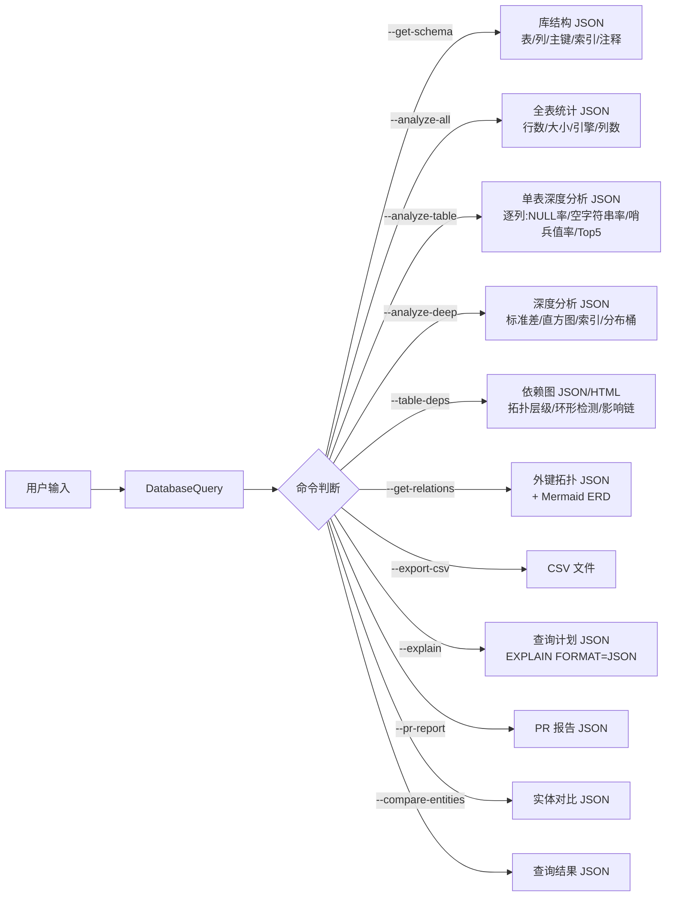

---
name: java-mysql-query
description: 本地 Java + MySQL 数据库查询与分析工具。支持自然语言查询、统计表结构、深度分析数据分布、外键关系拓扑、数据质量三指标评估、Java 实体类对比和 PR 报告生成。可选配合 Superpowers 技能链提升分析效率。
---

## 前置条件
1. MySQL 服务已启动。2. MySQL JDBC 驱动位于 classpath（`--install-driver` 自动安装）。3. 凭据首次输入后自动保存到 `~/.java-mysql-query-config.json`。4. 编译用 `-encoding utf8` 参数。

## 凭证持久化
首次连接用完整参数（`--db mydb --user root --password mypass --get-schema`），连接成功即自动保存。后续直接说话即可，无需重复输入账号密码。

| 命令 | 作用 |
|------|------|
| `--save-config` | 手动保存当前连接参数 |
| `--clear-config` | 清除已保存的配置文件 |

## 首次安装
```
java -cp <skill目录> scripts.DatabaseQuery --install-driver
```
自动输出下载地址和 PowerShell 安装命令。手动下载：`Invoke-WebRequest -Uri 'https://repo1.maven.org/.../mysql-connector-j-8.3.0.jar' -OutFile 'mysql-connector-j-8.3.0.jar'`

## 连接参数
所有命令前可加以下参数（顺序任意）：

| 参数 | 默认值 | 说明 |
|------|--------|------|
| `--host <host>` | `localhost` | 数据库主机 |
| `--port <port>` | `3306` | 端口 |
| `--db <db>` | `DB_NAME` 环境变量 | 数据库名称 |
| `--user <user>` | `root` | 用户 |
| `--password <pwd>` | `DB_PASSWORD` 环境变量 | 密码 |
| `--ssl <mode>` | `false` | SSL 模式：false/true/verify-ca |

## 命令参考
| 命令 | 说明 |
|------|------|
| `--get-schema` | 获取所有表结构（引擎/列/主键/索引/注释） |
| `--analyze-all` | 全表统计（行数/大小/列数，按行数降序） |
| `--analyze-table <表名>` | 单表深度分析：逐列NULL率/空字符串率/哨兵值率/极值/TOP5高频值 + 综合质量评分 |
| `--analyze-deep <表名>` | 深度分析：标准差/直方图/索引使用/分布桶 |
| `--table-deps` | 表依赖关系图：拓扑层级/环形依赖检测/影响链分析 |
| `--get-relations` | 外键关系拓扑 + Mermaid ERD 文本 |
| `--explain <SQL>` | 查询计划分析（EXPLAIN FORMAT=JSON） |
| `--export-csv <SQL>` | 导出查询结果为 CSV |
| `--pr-report [表名...]` | PR 报告：表结构摘要 + 行数快照 |
| `--compare-entities --entity-path <路径>` | Java 实体 vs 数据库表差异对比 |
| `<SQL语句>` | 执行自定义 SQL 查询（仅 SELECT） |

## 工作流集成（可选）
DatabaseQuery 所有命令完全独立，不依赖 Superpowers。如需增强分析效率，可安装 Superpowers 技能链（`brainstorming` / `writing-plans` / `systematic-debugging` / `verification-before-completion` / `dispatching-parallel-agents`）。

推荐配合 `java-superpowers-contract` 使用：DatabaseQuery 提供数据，契约管控全流程。

## 安全红线
- **严禁**执行 `DROP`/`DELETE`/`UPDATE`/`INSERT`/`ALTER`/`TRUNCATE` 等写操作，仅允许 `SELECT` 查询。
- JSON 输出已做转义处理，防止注入。

## 数据流简图

