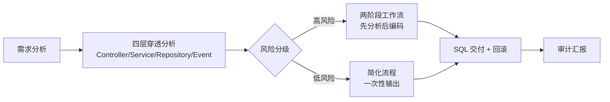

# Java 研发现控契约 (java-superpowers-contract)

> 最小改动、环境物理隔离、SQL 回滚红线、两阶段工作流、方法级锚定、全时审计。

## 快速开始

```bash
# 1. 安装依赖
pip install -r requirements.txt

# 2. 配置数据库连接（可选，按实际情况修改）
cp .env.example .env
# 编辑 .env 填入 DB_NAME / DB_USER / DB_PASSWORD

# 3. 体验一个分析
cd scripts
python database_query.py --db mydb --get-schema

# 或者直接传参数（不需要 .env）
python database_query.py --host localhost --db mydb --user root --password yourpass --get-schema
```

## 文件一览

| 文件 | 用途 |
|------|------|
| [SKILL.md](SKILL.md) | Codex 行为契约（系统级 enforce，内部使用） |
| [docs/TOOLCHAIN.md](docs/TOOLCHAIN.md) | 工具使用手册 |
| [.env.example](.env.example) | 数据库凭据模板 |
| [requirements.txt](requirements.txt) | Python 依赖 |
| [scripts/](scripts/) | 11 组 Python 分析工具 |
| [references/](references/) | 审计示例、提交规范、质量指标等参考 |

## 工作流概览



## 安全规则

- 所有脚本**仅允许 SELECT**，严禁 DROP/DELETE/UPDATE/INSERT/ALTER/TRUNCATE
- 每条 DDL 必须附带 `-- rollback` 回滚语句
- 禁止修改已有 API 签名，新增字段必须可选有默认值
- 密码优先使用环境变量，配置文件自动加密存储

## 前置条件

- Python 3.8+
- MySQL 服务可用（使用 database_query 相关工具时需要）
- 安装 `pymysql`: `pip install -r requirements.txt`
## 新增工具

| 工具 | 用途 |
|------|------|
| java_compiler | Maven/Gradle 自动编译验证 |
| java_static_analyzer | Checkstyle/PMD/SpotBugs 静态代码分析 |

### 编译验证
```bash
python scripts/java_compiler.py --path ./my-project
```

### 静态分析
```bash
python scripts/java_static_analyzer.py --path ./my-project --summary
```

## 前置条件（新增）

- JDK 11+（编译验证时需要）
- Maven 或 Gradle（编译验证时需要，根据项目类型自动检测）
- Checkstyle / PMD / SpotBugs（静态分析可选）
